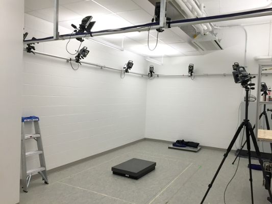
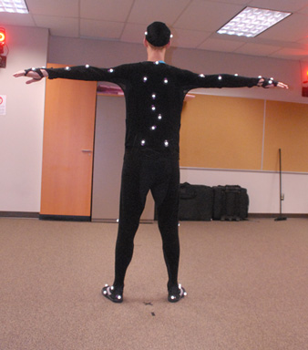
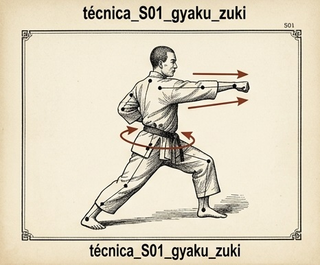
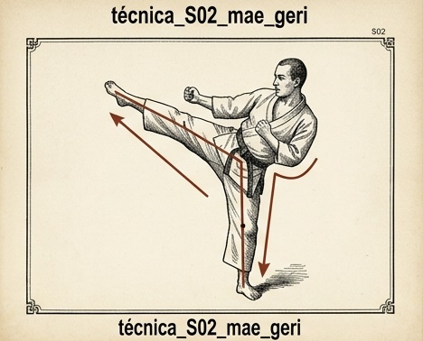
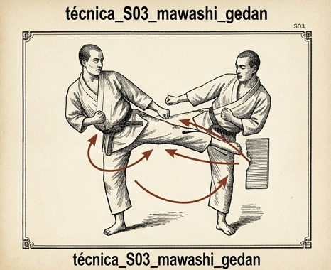
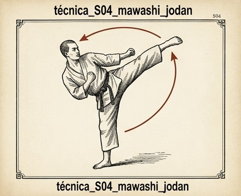
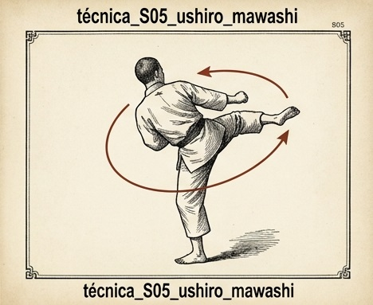
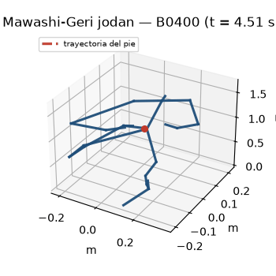
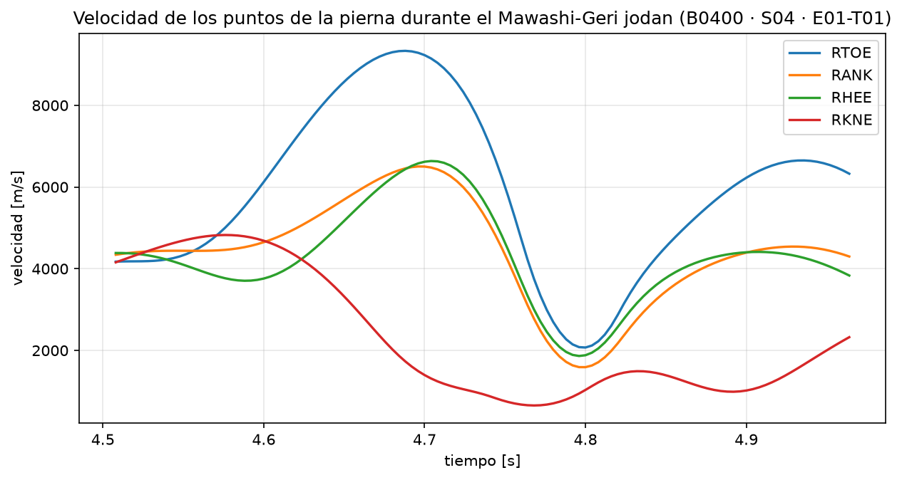

# Karate Athlete Performance Intelligence — Auditoría exploratoria

Proyecto de Sports Analytics / Machine Learning aplicado a karate Kyokushin.

Objetivo del trabajo: convertir grabaciones públicas de **optical motion capture** (Vicon, formato C3D) en un dataset tabular **1 fila = 1 ejecución**, extraer features biomecánicas por ejecución y preparar experimentos de ML (clasificación de técnica, condición y nivel).

Dataset público de Agnieszka Szczęsna, Monika Błaszczyszyn, Magdalena Pawlyta (*Scientific Data* 2021, DOI 10.1038/s41597-021-00801-5, [figshare](https://doi.org/10.6084/m9.figshare.c.4981073)).

Subconjunto local: **dataset completo descargado en `atletas/`** (37 atletas, 1411 C3D); trabajo controlado en B0367 (26) y B0377 (39).

<p align="center">
  
  
</p>

_Sistema de cámaras de motion capture (Vicon) — Atleta con marcadores reflectantes (modelo PlugInGait)._

> **Resumen:** Fases 1, 1.5, 1.6, 1.6.1, 1.6.2, 1.7, **1.8A (config por atleta)**, **1.8B-1 (feature readiness)**, **1.8C (Athlete Data Mart)**, **1.8D (Dashboard MVP)**, **1.8E (inventario completo)** y **1.8F Tarea 0 (selección de 3 candidatos)** completadas. El mismo motor parametrizado procesa B0367 (26 ejecuciones, QC 26/26) y B0377 (13 controladas, QC 13/13) usando `config/athletes/<id>.yaml`. Golden path S02/S03/S05-E01-T01 → **18 ejecuciones con features comparables** en un **Data Mart** (`output/data_mart/athlete_execution_features.csv`), consumido por un **Dashboard MVP en Streamlit** (`dashboard/app.py`). El dataset completo (37 atletas / 1411 C3D) fue inventariado estructuralmente (`output/athlete_inventory/`): 200 Hz ×4 atletas, 250 Hz ×33, 0 anomalías. La Fase 1.8F (Tarea 0) seleccionó de forma reproducible y estructural (NO de rendimiento) 3 atletas 250 Hz / Grupo B para la prueba controlada de generalización: **B0400, B0371 y B0380** (`output/scaling_selection/`). La Tarea 1 determinó con evidencia (E01-T01) señal y lateralidad por técnica: S02–S05→RTOE mayormente; **B0380-S02→LTOE (izquierda)** y S01 con baseline alto en B0371/B0380 → `NEEDS_VALIDATION`. La Tarea 2 convirtió el audit en **configuraciones explícitas por atleta** (`config/athletes/B0400|B0371|B0380.yaml`, 250 Hz, `validation.status: provisional`, sin procesar). La Tarea 3 ejecutó el **Golden Path E01-T01×S01–S05** con esas configs: **46 ejecuciones aceptadas / 93 eventos**, B0380-S02 usó **LTOE/L**, patadas estables; hallazgo: **S01 de B0371/B0380 no pudo usar RFIN** (gate `min_snr=8` → fallback RTOE, `REVIEW_REQUIRED`) — documentado, no corregido (`output/scaling_validation/`). La Tarea 4 (validación S01, 5 atletas × RFIN/LFIN/RTOE) confirmó que RFIN es segmentable en B0367/B0400 pero **no en B0371/B0380** (baseline+MAD altos, actividad continua) y que **LFIN no rescata**; fallback RTOE débil → **recomendación: excluir S01 del primer dataset ML** (Opción B), construir con S02–S05 (`output/scaling_validation/s01_validation/`). La Tarea 5 **expandió la cohorte 250 Hz**: 33/33 auditados, **29 configs nuevas**, **410 ejecuciones aceptadas S02–S05** (373 nuevas + 37 Task 3), 27 READY_FOR_CONFIG + 2 PARTIAL_CONFIG (S04 en B0388/B0401), **lateralidad izquierda en 70 celdas** → la señal/lado se valida por atleta×técnica (`output/scaling_validation/cohort_expansion/`). La Tarea 6 **consolidó el Data Mart 250 Hz con el contrato intacto**: **428 filas** (18 históricas preservadas + 410 nuevas), 34 atletas, `execution_id` único, 0 duplicados/NaN, `source_dataset` trazable, backup en `data_mart/task6_backup/`. La **Task 7** diseñó y auditó el **ML Dataset v0**: **419 filas / 33 atletas / 11 features**, target `technique` (clases S02=106/S03=104/S04=94/S05=115, BALANCED), 0 NaN, leak excluido (`primary_signal`/`movement_side` fuera; identifiers separados), correlaciones altas documentadas, **GroupKFold baseline** (`output/ml_dataset_v0/`). La **Task 7B** ejecutó el **primer baseline ML** (clasificación de técnica S02–S05): `LogisticRegression` + `StandardScaler` per-fold, `GroupKFold(5)` por atleta, predicciones OOF sin leakage y determinista byte-identidad → A (con SNR) accuracy 0.629±0.079 / f1_macro 0.617±0.082; B (sin SNR) accuracy 0.651±0.059 / f1_macro 0.640±0.062 (`output/ml_results/`, vista `dashboard/app_ml.py`). La **Task 8A** analizó descriptivamente los errores OOF (146/419 en B; pares S03→S02·S02→S04·S03→S05·S04→S02; hip_rom/ankle_rom/duration_s con mayor diferencia correcto-vs-error) sin entrenar y con hashes verificados (`output/task8a_error_analysis/`). La **Task 8B** añadió el **baseline no lineal** (RandomForest, params fijos, folds congelados de 7B): OOF accuracy 0.663±0.115 / f1_macro 0.646±0.129 — media ligeramente superior al lineal (0.651±0.059 / 0.640±0.062) pero con **≈2× varianza entre folds**; 95 errores compartidos, 51 corregidos, 46 nuevos (`output/ml_results_task8b/`). La **Task 9** construyó la **capa de inferencia demo** (`inference/`, `predict_execution(features)` → técnica + probabilidades + confidence + perfil; artefacto `output/ml_inference/task8b_rf.joblib`; CLI `scripts/21_demo_inference.py`) sobre ejecuciones reales del v0, sin retraining de validación ni tuning. La **Task 10** construyó el **Athlete Performance Dashboard** (demo, tablet-first, castellano: `dashboard/app_performance.py` + capas `performance_data`/`performance_ui`), que selecciona una ejecución real del v0 y muestra predicción + confidence + probabilidades + perfil biomecánico vía `inference::predict_execution` (estado inicial S04 92 %, sin sklearn en el dashboard). La **Task 11** añadió la **comparación descriptiva** (perfil de referencia por técnica: mediana+Q1–Q3; diferencias absolutas/% y estado por encima/dentro/por debajo del rango) y **sugerencias para el entrenador** (observación→revisión, sin causalidad) en el dashboard (`performance_analysis.py`). Baseline B0367 intacto. No se entrenan modelos definitivos ni se convierte el dataset masivamente a CSV.

---

## Datos disponibles para el análisis

Esta sección describe **qué contienen los archivos C3D** (verificado experimentalmente; informe completo en [`docs/dataset_audit.md`](docs/dataset_audit.md)).

### 1. Inventario del subconjunto local

| Atributo | B0367 | B0377 |
|----------|-------|-------|
| Archivos C3D | 26 | 39 |
| Fecha | 2017-01-31 | 2017-02-20 |
| Técnicas | S01–S05 | S01–S05 |
| Condiciones | E01, E02, E04 | E01, E02, **E03**, E04 |
| Trials | T01, T02 | T01, T02 |
| Frecuencia real | **200 Hz** | **250 Hz** |
| Tamaño | ~0.212 GB | — |

Nomenclatura de archivos: `YYYY-MM-DD-CODE-S0X-E0Z-T0J.c3d`.
- S01 = Gyaku-Zuki (puño recto), S02 = Mae-Geri (patada frontal), S03 = Mawashi-Geri gedan, S04 = Mawashi-Geri jodan, S05 = Ushiro-Mawashi-Geri.
- E01 = aire, E02 = escudo (shield), E03 = atacante (ausente en B0367), E04 = defensor.
- T01/T02 = trial 1 / 2 por técnica+condición.

Cobertura en B0367 (técnica × condición × trial; 1 = presente):

| | E01 T01 | E01 T02 | E02 T01 | E02 T02 | E04 T01 | E04 T02 |
|--|---------|---------|---------|---------|---------|---------|
| S01 | 1 | 0 | 1 | 1 | 1 | 1 |
| S02 | 1 | 1 | 1 | 1 | 1 | 1 |
| S03 | 1 | 1 | 1 | 1 | 1 | 1 |
| S04 | 1 | 1 | 1 | 1 | 1 | 1 |
| S05 | 1 | 1 | 1 | 0 | 0 | 0 |

> E03 (attacker) **no** está en B0367. S05 solo tiene 3 archivos (cobertura parcial). B0377 sí es completo (incluye E03).

### 2. Qué hay dentro de cada C3D

Por punto, el C3D guarda **filas X, Y, Z + residual**, en **mm**. Cada grabación E01/E02 trae **218 puntos**:

- **39 marcadores anatómicos PlugInGait** (cabeza, columna/clavícula/tórax, hombros, brazos/antebrazos, codos, muñecas, manos, pelvis, muslos, rodillas, tibias, tobillos, talones, dedos de los pies).
- **76 marcadores de cluster** (grupos de 4 por segmento: pelvis, fémur, tibia, pie, punta, cabeza, clavícula, torso, húmero, radio, mano).
- **103 variables biomecánicas derivadas ya calculadas** por el pipeline Vicon/PlugInGait (no hay que derivarlas nosotros):
  - **30 ángulos articulares** (LHipAngles, LKneeAngles, LElbowAngles, LSpineAngles, RHeadAngles, ...).
  - **16 potencias** (LHipPower, LKneePower, LAnklePower, LShoulderPower, ...).
  - **16 fuerzas + 16 momentos** (estimaciones del modelo, NO medidas de plataformas).
  - **15 centros de masa** (CentreOfMass, PelvisCOM, LeftFemurCOM, HeadCOM, ...).
  - **~10 centros articulares** (LHJC, RHJC, LKJC, RKJC, LAJC, RAJC, ...).
- En **E02** se añaden **6 marcadores del escudo** (`Tarcza1`–`Tarcza6`).

En **E04 (defensor)** el archivo contiene **dos sujetos** (B0367 defensor + B0368 atacante) → **397 puntos** (2 × ~198). El atleta del dataset **defiende**; quien ejecuta la técnica es el oponente. Solo hay 23 variables derivadas en E04.

**Técnicas analizadas (S01–S05):**

| S01 · Gyaku-Zuki | S02 · Mae-Geri | S03 · Mawashi-Geri gedan | S04 · Mawashi-Geri jodan | S05 · Ushiro-Mawashi-Geri |
|---|---|---|---|---|
|  |  |  |  |  |

### 3. Características técnicas verificadas

- **Ejes:** X = frontal (izquierda→derecha), Y = sagital (adelante→atrás), Z = vertical.
- **Unidades:** mm (POINT.UNITS); ángulos en deg; derivadas en N, N·mm, W.
- **Frecuencia:** 200 Hz en B0367 y 250 Hz en B0377 (**el paper cita 250 Hz** — discrepancia documentada).
- **Fabricante:** Vicon. **Sin canales analógicos** (sin plataformas de fuerza, sin EMG): fuerzas/momentos son estimaciones del modelo PlugInGait, no reacción en el suelo.
- **NaN/missing:** bajo (~0.15–0.20 % de frames por eje), por oclusión en brazos/piernas.
- **Línea base:** el archivo empieza con el atleta quieto en kumite-no-kamae (velocidad del pie 14–32 mm/s).
- **Eventos Vicon:** 4 genéricos por archivo ("Event"/"General"), no segmentan fases específicas — la segmentación debe derivarse de las señales.

### 4. Qué se puede medir vs. qué NO

**Sí se puede medir:** cinemática 3D completa (trayectorias, velocidades, aceleraciones de cualquier marcador), ángulos y velocidades articulares, ROM articular, fases de ejecución (método reproducible), COM y estabilidad, simetría L/R, coordinación proximal-distal, repetibilidad T01 vs T02 (DTW), comparación aire vs escudo (E01 vs E02), distancia al escudo (Tarcza) y entre atletas (E04).

**NO se puede medir con este subconjunto:** fuerza de reacción del suelo (GRF) y momentos reales (sin plataformas), EMG, presión plantar, impacto instrumentado sobre el objetivo, respuesta fisiológica/fatiga, ni nada concluyente sobre nivel del atleta (n=1, sin validez estadística).

### 5. Visualización de una ejecución (Mawashi-Geri jodan)

Ejemplo generado desde `B0400-S04-E01-T01`: stick figure 3D de la ejecución con la **trayectoria del pie en rojo** (izquierda) y la **velocidad de los puntos de la pierna** (derecha) sobre la misma ventana de la patada. Se visualiza también en el Dashboard (`streamlit run dashboard/app.py`).

| Wireframe (trayectoria del pie en rojo) | Velocidad de los puntos de la pierna |
|---|---|
|  |  |

---

## Resumen de fases realizadas

Qué se ha hecho hasta el momento, con su script, salida y estado. Informes detallados en `docs/`.

| Fase | Objetivo | Script | Salidas | Estado |
|------|----------|--------|---------|--------|
| **1 — Auditoría del dataset** | Inventariar, inspeccionar técnicamente y mapear los 26 C3D de B0367; validar lectura con ezc3d; documentar variables, calidad, visualizaciones, features y riesgos de ML | `01_dataset_exploration.py` | `output/tables/`, `output/figures/`, `output/exploration_log.txt` | ✅ Completada |
| **1.5 — Pipeline de ejecuciones** | Validar el pipeline `C3D → repeticiones → segmentación → features → 1 fila = 1 ejecución` | `02_execution_segmentation.py` | `executions_sample.csv`, `execution_quality.csv`, `phase_validation/`, `dtw_validation/`, `condition_comparison/` | ✅ Completada |
| **1.6 — QC y trazabilidad** | Resolver discrepancia 17 vs 20; clasificar eventos accepted/rejected/review con razón; verificar unidades/frecuencia | `01` + `02` + `tests/test_pipeline.py` | `segmentation_events.csv`, `qc_summary.csv`, `units_verified.csv`, `execution_features_sample.csv` | ✅ Completada |
| **1.6.1 — Señales S03/S05** | Determinar experimentalmente la mejor señal de segmentación para Mawashi-Geri gedan y Ushiro-Mawashi-Geri (criterio ≠ solo SNR) | `03_signal_validation.py` | `output/signal_validation/` | ✅ Completada |
| **1.6.2 — Reconciliación de conteos** | Aclarar diferencia entre trials de validación (7) y trials integrados al pipeline (8) — no hay bug, miden cosas distintas | revisión de config/scripts/CSV | `docs/phase_1_6_2_report.md` | ✅ Completada |
| **1.7 — Generalización a B0377** | Probar el pipeline en un segundo atleta sin tocar el baseline; comparar estructura y lateralidad | `04_athlete_generalization_audit.py` | `output/athlete_generalization/` | ✅ Completada |
| **1.8A — Config por atleta** | Parametrizar señal/lateralidad/joints/rutas por atleta en YAML con un único motor | `02` (motor) + `05_phase_1_8a_validation.py` | `config/athletes/<id>.yaml`, `output/phase_1_8a/` | ✅ Completada (regresión + S01/S04 OK) |
| **1.8B-1 — Feature readiness** | Verificar que el golden path (S02/S03/S05-E01-T01) genera features mínimas comparables entre atletas | `06_feature_readiness.py` | `feature_readiness_sample.csv`, `feature_readiness_audit.csv` | ✅ Completada (18 ejecuciones; corregido bug event_id) |
| **1.8C — Athlete Data Mart** | Consolidar golden path en un Data Mart estable (identidad + metadata + features + comparabilidad + versiones) para el futuro Dashboard/ML | `07_build_athlete_data_mart.py` | `output/data_mart/athlete_execution_features.csv`, `data_mart_summary.csv` | ✅ Completada (18 filas; validaciones OK) |
| **1.8D — Dashboard MVP** | Dashboard local (Streamlit) que lee SOLO el Data Mart: overview, técnica/ejecución, consistencia, comparación y comparabilidad | `dashboard/app.py` (+ `data.py`, `components.py`) | `docs/phase_1_8d_dashboard.md` | ✅ Completada (61 tests; 22 charts) |
| **1.8E — Inventario completo** | Inventario estructural de todo el dataset (37 atletas / 1411 C3D): frecuencias, unidades, markers, derivadas, roles, anomalías y readiness de escalado | `08_athlete_inventory.py` | `output/athlete_inventory/` (11 CSV), `docs/phase_1_8e_athlete_inventory.md` | ✅ Completada (74 tests; 0 anomalías) |
| **1.8F (Tarea 0) — Selección de 3 candidatos** | Selección reproducible y auditable (estructural, NO de rendimiento) de 3 atletas 250 Hz / Grupo B para la prueba controlada de generalización: **B0400, B0371, B0380** | `08_select_1_8f_candidates.py` | `output/scaling_selection/`, `docs/phase_1_8f_candidate_selection.md` | ✅ Tarea 0 completada (32 elegibles; determinista) |
| **1.8F (Tarea 1) — Auditoría de señal y lateralidad** | Determinar con evidencia señal/lateralidad por técnica (E01-T01) para B0400/B0371/B0380: S02-S05→RTOE mayormente; **B0380-S02→LTOE (izquierda)**; S01 RFIN (B0371/B0380 con baseline alto → NEEDS_VALIDATION) | `09_signal_laterality_audit.py` | `output/scaling_selection/phase_1_8f_signal_audit.csv`, `phase_1_8f_signal_recommendations.csv`, `signal_audit/*.png`, `docs/phase_1_8f_signal_laterality_audit.md` | ✅ Tarea 1 completada (15 recomendaciones; determinista; sin configs) |
| **1.8F (Tarea 2) — Configuraciones explícitas** | YAML por atleta (B0400/B0371/B0380) con señal/lateralidad del audit, 250 Hz, estados RECOMMENDED/NEEDS_VALIDATION; validación cruzada contra `phase_1_8f_signal_recommendations.csv` (fuente única) | `config/athletes/{B0400,B0371,B0380}.yaml` (creados) | `docs/phase_1_8f_configurations.md` | ✅ Tarea 2 completada (7 tests nuevos; sin procesar C3D) |
| **1.8F (Tarea 3) — Golden Path E01-T01×S01–S05** | Primera ejecución controlada del pipeline sobre B0400/B0371/B0380 con las configs de Task 2: **46 ejecuciones aceptadas / 93 eventos**; B0380-S02 usó **LTOE/L**; las patadas dan 3 aceptadas/celda; **S01 de B0371/B0380 no usó RFIN (gate min_snr=8 → fallback RTOE), REVIEW_REQUIRED** | `10_phase_1_8f_task3_golden_path.py` | `output/scaling_validation/`, `docs/phase_1_8f_task3_golden_path.md` | ✅ Tarea 3 completada (14 tests nuevos; sin tocar data_mart/algoritmo) |
| **1.8F (Tarea 4) — Validación dirigida de S01 (pre-ML)** | Auditoría S01 (5 atletas × RFIN/LFIN/RTOE, E01-T01): RFIN segmentable en B0367/B0400; B0371/B0380 con baseline alto + MAD alto (actividad continua) → fallback RTOE débil (RFIN_NOT_VALIDATED;RTOE_FALLBACK_NOT_VALIDATED); LFIN no rescata; **recomendación global: Opción B (excluir S01 del primer dataset ML)** | `11_s01_targeted_validation.py` | `output/scaling_validation/s01_validation/`, `docs/phase_1_8f_task4_s01_validation.md` | ✅ Tarea 4 completada (9 tests nuevos; sin cambios de algoritmo/gate/config) |
| **1.8F (Task 5) — Expansión controlada de la cohorte 250 Hz** | Pipeline de incorporación completo sobre los 29 atletas pendientes: auditoría señales/lateralidad (E01-T01 × S02–S05) → recomendaciones → **29 configs nuevas** → Golden Path → estados. Resultado: **27 READY_FOR_CONFIG + 2 PARTIAL_CONFIG (B0388/B0401: S04 NEEDS_VALIDATION)**; **410 ejecuciones aceptadas S02–S05** (373 nuevas + 37 Task 3); **70 celdas en Golden Path con lateralidad izquierda**; S01 presente solo como NEEDS_VALIDATION (sin procesar); Data Mart intacto | `13_phase_1_8f_cohort_expansion.py` | `output/scaling_validation/cohort_expansion/`, `config/athletes/*.yaml` (29 nuevos), `docs/phase_1_8f_task5_cohort_expansion.md` | ✅ Task 5 completada (11 tests nuevos; sin ML ni data_mart) |
| **1.8F (Task 6) — Consolidación controlada del Data Mart 250 Hz** | Amplía el Data Mart **con el contrato intacto (39 columnas)**: 18 históricas preservadas + **410 ejecuciones aceptadas S02–S05 (250 Hz)** = **428 filas**, 34 atletas, `execution_id` único, 0 NaN, 0 duplicados, backup en `data_mart/task6_backup/`, `source_dataset` trazable (`feature_readiness_sample`/`task3_golden_path`/`cohort_expansion_gp`); S01 y 200 Hz fuera; B0388/B0401-S04 sin filas (partidarios) | `14_consolidate_250hz_data_mart.py` | `output/data_mart/task6_backup/`, `data_mart/task6_consolidation/`, `docs/phase_1_8f_task6_data_mart_consolidation.md` | ✅ Task 6 completada (tests actualizados al nuevo contrato; sin ML/normalización) |
| **1.8F (Task 7) — Diseño y auditoría del ML Dataset v0** | Dataset preparado para ML desde el Mart (250 Hz × S02–S05 × E01-T01 × accepted): **419 filas / 33 atletas**, target `technique` (clases S02=106/S03=104/S04=94/S05=115, BALANCED), **11 features** candidatas (0 NaN), audit completo (leakage: sólo identifiers `execution_id`+`athlete_id`; `primary_signal`/`movement_side`/`source_dataset` excluidas; correlaciones altas documentadas; outliers por IQR sin eliminar), **GroupKFold baseline** documentado en `ml_validation_strategy.md` | `15_build_ml_dataset_v0.py` | `output/ml_dataset_v0/`, `docs/task_7_ml_dataset_v0_audit.md`, `docs/task_7_ml_dataset_v0_dictionary.md` | ✅ Task 7 completada (13 tests nuevos; sin entrenar, sin normalización fitting, Mart intacto) |
| **Task 7B — Baseline ML + evaluación por atleta + Dashboard ML** | Primer experimento controlado de clasificación de técnica (S02–S05) con `LogisticRegression` + `StandardScaler` per-fold y **GroupKFold(5) por atleta**: baseline A (11 feats, con SNR) → **accuracy 0.629±0.079 / f1_macro 0.617±0.082**; baseline B (10 feats, sin SNR) → **accuracy 0.651±0.059 / f1_macro 0.640±0.062**; **predicciones OOF (419/exp), sin leakage, determinista byte-identidad**, matriz de confusión, errores, coeficientes y **Dashboard ML** (`dashboard/app_ml.py`, presentación read-only): `output/ml_results/` | `16_task7b_baseline_ml.py` + `dashboard/app_ml.py` | `output/ml_results/`, `docs/task_7b_baseline_ml.md`, `docs/task_7b_experiment_card.md` | ✅ Task 7B completada (14 tests nuevos; v0 y Mart intactos; sin tuning) |
| **Task 8A — Análisis de errores OOF (post-hoc)** | Análisis descriptivo (sin entrenar) de los errores OOF del baseline sobre **Experimento B**: 146/419 errores (34.8 %); pares S03→S02 (18), S02→S04 (17), S03→S05 (17), S04→S02 (16); **144 errores compartidos A/B**; features con mayor diferencia descriptiva **hip_rom, ankle_rom, duration_s, time_to_peak_s**; errores de baja/estándar confianza; sin ranking y con hashes de integridad verificados | `18_task8a_error_analysis.py` | `output/task8a_error_analysis/`, `docs/task_8a_error_analysis.md` | ✅ Task 8A completada (12 tests; v0/ml_results/Data Mart/dashboard intactos) |
| **Task 8B — Baseline no lineal interpretable (RandomForest)** | Segunda baseline con **parámetros fijos** y **los mismos folds congelados de Task 7B** (GroupKFold por atleta, validado): OOF accuracy **0.663±0.115** / f1_macro **0.646±0.129** (vs LogReg-B 0.651±0.059 / 0.640±0.062) — media ligeramente superior pero **≈2× más varianza entre folds**; errores 141 (vs 146), 95 compartidos, 51 corregidos, 46 nuevos; sin ganador declarado; `hip_rom`/`amax` con mayor importancia relativa | `19_task8b_nonlinear_baseline.py` | `output/ml_results_task8b/`, `docs/task_8b_nonlinear_baseline.md`, `docs/task_8b_experiment_card.md` | ✅ Task 8B completada (15 tests en `tests/test_task8b.py`; v0/7B/8A/Data Mart/dashboard intactos) |
| **Task 9 — Capa de predicción/inferencia (demo)** | Capa reutilizable e independiente del dashboard (`inference/`): `predict_execution(features)` → técnica predicha (S02–S05), probabilidades, `confidence` (prob del clasificador, no éxito) y perfil biomecánico. Artefacto demostrativo a partir del **Random Forest de Task 8B** (`output/ml_inference/task8b_rf.joblib`, sha256 documentado, serialización determinista) + CLI `scripts/21_demo_inference.py` sobre ejecuciones reales | `inference/` + `20_build_inference_artifact.py` + `21_demo_inference.py` | `output/ml_inference/`, `docs/task_9_prediction_inference.md`, `tests/test_inference.py` | ✅ Task 9 completada (13 tests; sin retraining de validación, sin tuning, v0/ml_results/dashboard intactos) |
| **Task 10 — Athlete Performance Dashboard (demo)** | Producto visual tablet-first en castellano: selección de una ejecución real del v0 → `predict_execution` → **Technique Prediction** (técnica + confidence % con aviso), probabilidades S02–S05, **perfil biomecánico** agrupado, indicador neutro coincides/difiere de referencia, «Qué ve el modelo» y disclaimer. App independiente (`app_performance.py`) con DATA→INFERENCE→PRESENTATION; sin sklearn | `dashboard/app_performance.py` + `performance_data.py` + `performance_ui.py` | `docs/task_10_athlete_performance_dashboard.md`, `tests/test_performance.py` | ✅ Task 10 completada (pytest `-k test_performance`; v0/ml_results/ml_inference/Data Mart/apps previas intactos) |
| **Task 11 — Comparación + Sugerencias para el entrenador** | Sobre el dashboard de performance: **perfil de referencia descriptivo** por técnica (mediana + Q1–Q3 de las 10 features, del v0), comparación ejecución-vs-referencia con **diferencia abs/%** (div-cero protegida) y **estado por encima/dentro/por debajo del rango**, **diferencias observadas** (2–4 automáticas, sin score), **sugerencias al entrenador** (observación→revisión, sin causalidad ni feature importance) y comparación entre dos ejecuciones (misma técnica) | `dashboard/performance_analysis.py` + `app_performance.py` | `docs/task_11_comparison_coach_insights.md`, `tests/test_analysis.py` | ✅ Task 11 completada (pytest `-k test_analy`; inference/ y el resto intactos) |
| **Task 12 — Tablet Polish / Presentación de producto** | Pulido de **presentación** (solo UI, sin tocar modelo/datos/inference/análisis): header con chip **DEMO**, **barra de flujo A–D en recuadros de colores con flechas ➜**, **hero de predicción dominante** (confianza con barra), selector compacto + **wireframe GIF por atleta×técnica a la derecha** (galería `output/gallery/`, grid global fijo, puntos en marcadores, trayectoria roja), **foto de técnica con pulso suave** (flash al cambiar de ejecución), perfil por tarjetas, comparación con mini-barras, «Observaciones para el entrenador», tarjeta **EVOLUCIÓN DEL ATLETA (futura función)**, «Detalles del modelo» colapsable y disclaimer | `dashboard/app_performance.py` + `performance_ui.py` + `scripts/17` (refactor) + `scripts/22_build_athlete_gallery.py` | `docs/task_12_tablet_polish.md` | ✅ Task 12 completada (129 GIF generados; `pytest -k "test_analy or test_performance or test_inference"`; datasets/inference/apps previas intactos) |
| **Siguiente** | Cuando existan sesiones longitudinales reales: materializar la evolución del atleta (reutilizando `performance_analysis`); consolidar evidencia 8A/8B; normalización 200/250 Hz; Grupo C; S01 por separado | — | — | ⏳ Pendiente |

**Hallazgo transversal importante:** la configuración es **por atleta y por técnica** (B0367: S01=RFIN, S02–S05=RTOE, lateralidad derecha; B0377: S04=LTOE; cohorte 250 Hz: **70 celdas del Golden Path usan lateralidad izquierda**). La selección de señales de B0367 **no es universal**; la lateralidad y la señal deben validarse por celda `athlete × technique`.
Para ML futuro se usará siempre **división por participante (GroupKFold / Leave-One-Subject-Out)**, nunca random split por archivo.

---

## Estructura del proyecto

```
Deporte_sensores/
├── B0367/                      # Datos originales B0367 (NO MODIFICAR)
├── atletas/
│   └── B0377/                  # Segundo atleta (Fase 1.7/1.8A)
├── config/
│   ├── segmentation.yaml       # Config global (umbrales, método)
│   └── athletes/
│       ├── B0367.yaml          # Config por atleta (señal/lateralidad/joints)
│       ├── B0377.yaml
│       ├── B0400.yaml          # Fase 1.8F Tarea 2 (auditoría 1.8F Tarea 1)
│       ├── B0371.yaml          # Fase 1.8F Tarea 2 (S01 NEEDS_VALIDATION)
│       └── B0380.yaml          # Fase 1.8F Tarea 2 (S02 LTOE/L)
├── scripts/
│   ├── 01_dataset_exploration.py    # Fase 1: auditoría del dataset
│   ├── 02_execution_segmentation.py # Fase 1.5/1.6/1.8A: motor por atleta
│   ├── 03_signal_validation.py      # Fase 1.6.1: validación de señales S03/S05
│   ├── 04_athlete_generalization_audit.py  # Fase 1.7: auditoría de generalización
│   ├── 05_phase_1_8a_validation.py  # Fase 1.8A: regresión + S01/S04
│   ├── 06_feature_readiness.py      # Fase 1.8B-1: features mínimas comparables (golden path)
│   ├── 07_build_athlete_data_mart.py  # Fase 1.8C: consolida el Data Mart (capas de datos)
│   └── 08_athlete_inventory.py       # Fase 1.8E: inventario completo del dataset (37 atletas)
│   └── 08_select_1_8f_candidates.py  # Fase 1.8F (Tarea 0): selección de 3 atletas candidatos
│   └── 09_signal_laterality_audit.py # Fase 1.8F (Tarea 1): auditoría de señal/lateralidad
│   └── 10_phase_1_8f_task3_golden_path.py # Fase 1.8F (Tarea 3): Golden Path E01-T01×S01-S05
│   └── 11_s01_targeted_validation.py      # Fase 1.8F (Tarea 4): validación dirigida de S01
│   └── 13_phase_1_8f_cohort_expansion.py  # Fase 1.8F (Task 5): expansión cohorte 250 Hz
│   └── 14_consolidate_250hz_data_mart.py  # Fase 1.8F (Task 6): consolidación Data Mart 250 Hz
│   └── 15_build_ml_dataset_v0.py          # Task 7: diseño/auditoría del ML Dataset v0
│   └── 16_task7b_baseline_ml.py           # Task 7B: baseline ML (LogReg, GroupKFold por atleta)
│   └── 18_task8a_error_analysis.py        # Task 8A: análisis descriptivo de errores OOF
│   └── 19_task8b_nonlinear_baseline.py    # Task 8B: baseline RandomForest (parámetros fijos)
│   └── 17_make_mawashi_illustration.py    # generador del GIF/gráfica del Dashboard (visual)
│   └── 20_build_inference_artifact.py     # Task 9: materializa artefacto demo (RF 8B)
│   └── 21_demo_inference.py               # Task 9: CLI demo de inferencia sobre ejecuciones reales
│   └── 22_build_athlete_gallery.py        # Task 12: galería de wireframes por atleta×técnica (output/gallery)
├── dashboard/
│   ├── app.py                     # Fase 1.8D: Dashboard MVP (Streamlit, lee solo el Data Mart)
│   ├── app_ml.py                  # Task 7B: vista ML (Streamlit; consume output/ml_results/, sin ML)
│   ├── app_performance.py         # Task 10: Athlete Performance Dashboard (demo, tablet-first)
│   ├── performance_data.py        # Task 10: capa de datos del dashboard (v0 + features)
│   ├── performance_ui.py          # Task 10: helpers de presentación (castellano, sin streamlit)
│   ├── performance_analysis.py    # Task 11: perfil de referencia, comparación, coach insights
│   ├── data.py                    # capa de datos (Mart + ml_results, read-only)
│   └── components.py              # helpers de gráficos Plotly
├── inference/                    # Capa de inferencia (Task 9; demo; independiente del dashboard)
│   ├── __init__.py               # expone predict_execution / load_model / versiones
│   ├── predictor.py              # validación estricta + inferencia
│   ├── model_loader.py           # carga output/ml_inference/task8b_rf.joblib
│   └── schemas.py                # contrato (10 features sin SNR) y estructura del resultado
├── images/                       # imágenes de la Vista 6 (inventario local); opcionales
│   #   camera_system, athlete_markers, technique_S0X_<nombre>  (.png o .jpg)
├── tests/
│   ├── test_pipeline.py        # Tests mínimos (pytest; fases 1–8A + dashboard)
│   ├── test_task8b.py          # Tests específicos Task 8B (baseline RandomForest)
│   ├── test_inference.py       # Tests específicos Task 9 (capa de inferencia)
│   ├── test_performance.py     # Tests específicos Task 10 (dashboard de performance)
│   └── test_analysis.py        # Tests específicos Task 11 (comparación + coach insights)
│                               # Total suite: 195 + 15 + 13 + 12 + ~13 ≈ 248 tests
├── docs/
│   ├── dataset_audit.md         # Informe Fase 1 (archivos/calidad/features/ML)
│   ├── phase_1_5_report.md      # Informe Fase 1.5
│   ├── phase_1_6_report.md      # Informe Fase 1.6
│   ├── phase_1_6_1_report.md    # Informe Fase 1.6.1 (señales S03/S05)
│   ├── phase_1_6_2_report.md    # Informe Fase 1.6.2 (reconciliación de conteos)
│   ├── phase_1_7_report.md      # Informe Fase 1.7 (generalización a B0377)
│   ├── phase_1_8a_config_audit.md  # Auditoría de config (Fase 1.8A)
│   ├── phase_1_8a_report.md     # Informe Fase 1.8A (config por atleta)
│   ├── phase_1_8b_feature_readiness.md  # Informe Fase 1.8B-1 (features mínimas)
│   ├── phase_1_8c_data_mart.md      # Informe Fase 1.8C (Athlete Data Mart)
│   ├── phase_1_8d_dashboard.md      # Informe Fase 1.8D (Dashboard MVP)
│   ├── phase_1_8e_athlete_inventory.md  # Informe Fase 1.8E (inventario completo)
│   ├── phase_1_8f_candidate_selection.md  # Informe Fase 1.8F Tarea 0 (selección de 3 candidatos)
│   ├── phase_1_8f_signal_laterality_audit.md  # Informe Fase 1.8F Tarea 1 (señal/lateralidad)
│   ├── phase_1_8f_configurations.md      # Informe Fase 1.8F Tarea 2 (configs B0400/B0371/B0380)
│   ├── phase_1_8f_task3_golden_path.md   # Informe Fase 1.8F Tarea 3 (Golden Path)
│   ├── phase_1_8f_task4_s01_validation.md # Informe Fase 1.8F Tarea 4 (S01 pre-ML)
│   ├── phase_1_8f_task5_cohort_expansion.md # Informe Fase 1.8F Task 5 (expansión 250 Hz)
│   ├── phase_1_8f_task6_data_mart_consolidation.md # Informe Fase 1.8F Task 6 (Mart 250 Hz)
│   ├── task_7_ml_dataset_v0_audit.md      # Informe Task 7 (auditoría ML v0)
│   ├── task_7_ml_dataset_v0_dictionary.md # Diccionario del ML Dataset v0
│   ├── task_7b_baseline_ml.md             # Informe Task 7B (baseline ML)
│   ├── task_7b_experiment_card.md         # Experiment card (TASK7B_BASELINE_001)
│   ├── task_8a_error_analysis.md          # Informe Task 8A (errores OOF, descriptivo)
│   ├── task_8b_nonlinear_baseline.md      # Informe Task 8B (RandomForest, no lineal)
│   ├── task_8b_experiment_card.md         # Experiment card (TASK8B_NONLINEAR_002)
│   ├── task_9_prediction_inference.md     # Informe Task 9 (capa de inferencia, demo)
│   ├── task_10_athlete_performance_dashboard.md # Informe Task 10 (dashboard de performance)
│   ├── task_11_comparison_coach_insights.md # Informe Task 11 (comparación + coach insights)
│   ├── task_12_tablet_polish.md          # Informe Task 12 (presentación de producto/tablet)
│   └── athlete_data_mart_dictionary.md  # Data dictionary del Data Mart
├── output/
│   ├── athlete_generalization/  # Auditoría de generalización a B0377 (Fase 1.7)
│   ├── phase_1_8a/              # Validación de la config por atleta (1.8A)
│   ├── athlete_inventory/       # Inventario completo del dataset (Fase 1.8E; 11 CSV)
│   │   └── _checkpoint/         # checkpoints incrementales por atleta (reanudable)
│   ├── scaling_selection/      # Selección/auditoría de candidatos (Fase 1.8F)
│   │   ├── phase_1_8f_candidate_selection.csv   # Tarea 0: 3 atletas candidatos
│   │   ├── phase_1_8f_signal_audit.csv          # Tarea 1: métricas por atleta×técnica×señal
│   │   ├── phase_1_8f_signal_recommendations.csv # Tarea 1: 15 recomendaciones señal/lateralidad
│   │   └── signal_audit/       # figuras diagnósticas por técnica (Tarea 1)
│   ├── scaling_validation/    # Golden Path 1.8F Tarea 3 (E01-T01×S01-S05, solo 3 atletas)
│   │   ├── phase_1_8f_task3_golden_path.csv   # 1 fila = 1 ejecución aceptada
│   │   ├── phase_1_8f_task3_events.csv        # todos los eventos accepted/rejected/review
│   │   ├── phase_1_8f_task3_execution_quality.csv  # QC por ejecución
│   │   ├── phase_1_8f_task3_summary.csv       # por atleta×técnica
│   │   ├── s01_validation/            # validación dirigida S01 (Fase 1.8F Tarea 4)
│   │   │   ├── s01_signal_comparison.csv    # 15 filas (5 atletas × 3 señales)
│   │   │   ├── s01_athlete_assessment.csv   # 5 filas (evidencia + recomendación)
│   │   │   └── figures/             # 5 por atleta + 3 comparativas
│   ├── cohort_expansion/      # Expansión cohorte 250 Hz (Fase 1.8F Task 5)
│   │   ├── cohort_250hz_status.csv  # 33 atletas 250 Hz + estado
│   │   ├── cohort_signal_audit.csv / cohort_signal_recommendations.csv
│   │   ├── cohort_golden_path.csv / cohort_events.csv / cohort_execution_quality.csv
│   │   └── figures/           # cobertura, señal recomendada, lateralidad, eventos
│   │   └── figures/           # 15 figuras de segmentación + 2 resúmenes
│   ├── data_mart/              # Athlete Data Mart (428 filas: 18 histórico + 410 cohorte 250 Hz; Task 6)
│   │   ├── athlete_execution_features.csv  # Mart canónico (39 columnas, contrato estable)
│   │   ├── data_mart_summary.csv           # resumen (428/34 atletas/S02-S05)
│   │   ├── task6_backup/                   # copia del Mart pre-consolidación (Task 6)
│   │   └── task6_consolidation/            # diagnósticos Task 6 (validación, duplicados, cobertura, reconciliación)
│   ├── ml_dataset_v0/             # ML Dataset v0 (Task 7; SIN entrenar)
│   │   ├── ml_dataset_v0.csv      # 419×14 (identifiers execution_id+athlete_id, target technique, 11 features)
│   │   ├── dataset_manifest.csv   # roles de cada columna (identifier/feature/target)
│   │   ├── feature_audit.csv · feature_comparability_audit.csv · population_filter_audit.csv
│   │   ├── class_distribution.csv · athlete_coverage.csv · feature_distribution_summary.csv
│   │   ├── feature_correlation.csv · feature_by_technique.csv · outlier_audit.csv
│   │   ├── ml_validation_strategy.md  # GroupKFold por atleta (baseline)
│   │   └── figures/               # distribuciones, correlación, feature×technique
│   ├── ml_results/               # Resultados baseline ML (Task 7B; presentación en app_ml)
│   │   ├── oof_predictions.csv · fold_metrics.csv · baseline_comparison.csv
│   │   ├── metrics_by_class.csv · metrics_by_athlete.csv · confusion_matrix.csv
│   │   ├── classification_errors.csv · error_matrix.csv · feature_coefficients{,_summary}.csv
│   │   ├── fold_assignments.csv · experiment_config.json
│   │   └── figures/               # confusión, folds, clases, coeficientes, errores
│   ├── task8a_error_analysis/   # Análisis de errores OOF (Task 8A; post-hoc)
│   │   ├── error_summary.csv · feature_correct_vs_error.csv · technique_error_summary.csv
│   │   ├── confusion_pairs.csv · confusion_pair_profiles.csv · confidence_analysis.csv
│   │   ├── athlete_error_summary.csv · fold_error_summary.csv · ab_comparison.csv
│   │   ├── integrity_hashes.csv           # md5 antes/después (todo PASS)
│   │   └── figures/                       # confusión B, errores por técnica, pares, margen
│   ├── ml_results_task8b/    # Baseline no lineal RandomForest (Task 8B)
│   │   ├── oof_predictions.csv · fold_metrics.csv · global_metrics.csv
│   │   ├── metrics_by_technique.csv · confusion_matrix.csv · feature_importance.csv
│   │   ├── athlete_metrics.csv · error_comparison.csv · error_comparison_pairs.csv
│   │   ├── model_comparison.csv (7B-B vs 8B) · experiment_config.json · integrity_hashes.csv
│   │   └── figures/                       # confusión RF, métricas, importance, pares
│   ├── ml_inference/               # Artefacto de inferencia (Task 9, demo)
│   │   ├── task8b_rf.joblib        # modelo demo (RF Task 8B, ajuste completo; sha256 en info)
│   │   └── artifact_info.json      # modelo_version, features, sha256, md5 del v0, nota demo
│   ├── gallery/                    # Wireframes GIF por atleta×técnica (Task 12; indexado por manifest.csv)
│   │   ├── athlete_execution_features.csv  # 1 fila = 1 ejecución (18)
│   │   └── data_mart_summary.csv           # métricas del Data Mart
│   ├── B0377/                   # Salidas de B0377 (no tocan el baseline)
│   ├── feature_readiness_sample.csv  # golden path features (Fase 1.8B-1)
│   ├── figures/                # Visualizaciones Fase 1 (PNG)
│   ├── tables/                 # Tablas CSV Fase 1
│   ├── executions_sample.csv   # 1 fila = 1 ejecución B0367 (26, trazable)
│   ├── execution_features_sample.csv  # features por nivel conceptual
│   ├── execution_quality.csv   # control de calidad por ejecución
│   ├── segmentation_events.csv # TODOS los eventos (accepted/rejected/review)
│   ├── qc_summary.csv          # resumen total/valid/review/invalid
│   ├── units_verified.csv      # unidades/frecuencia leídas de los C3D
│   ├── phase_validation/       # segmentación validada visualmente
│   ├── signal_validation/      # comparativa de señales S03/S05 (1.6.1)
│   ├── dtw_validation/         # DTW T01 vs T02
│   ├── condition_comparison/   # E01 vs E02
│   └── exploration_log.txt / phase15_log.txt / phase18_*.txt
├── requirements.txt
└── README.md
```

---

## Requisitos

- Python 3.12
- Ver `requirements.txt`.

Instalación (Windows):

```bash
python -m venv .venv
.venv\Scripts\activate
pip install -r requirements.txt
```

Se usa **ezc3d** (≥1.7) para leer los C3D. La librería entrega los puntos como array `(4, n_points, n_frames)` con filas `X, Y, Z, residual` (mm).

---

## Cómo ejecutar la exploración

```bash
# Fase 1 — auditoría del dataset
.venv\Scripts\python scripts\01_dataset_exploration.py

# Fase 1.5/1.6/1.8A — pipeline por atleta (baseline B0367 -> output/)
.venv\Scripts\python scripts/02_execution_segmentation.py

# Procesar OTRO atleta (B0377 -> output/B0377/)
.venv\Scripts\python scripts/02_execution_segmentation.py B0377

# Fase 1.6.1 — validación de señales de S03/S05
.venv\Scripts\python scripts\03_signal_validation.py

# Fase 1.7 — auditoría de generalización (B0367 vs B0377)
.venv\Scripts\python scripts\04_athlete_generalization_audit.py

# Fase 1.8A — validación de la config por atleta (regresión + S01/S04)
.venv\Scripts\python scripts\05_phase_1_8a_validation.py

# Fase 1.8B-1 — features mínimas comparables (golden path S02/S03/S05-E01-T01)
.venv\Scripts\python scripts\06_feature_readiness.py

# Fase 1.8C — construir el Athlete Data Mart (consumirá el futuro Dashboard)
.venv\Scripts\python scripts\07_build_athlete_data_mart.py

# Fase 1.8D — lanzar el Dashboard MVP (Streamlit, lee solo el Data Mart)
streamlit run dashboard/app.py

# Task 7B — vista ML del Dashboard (consume output/ml_results/, NO ejecuta ML)
streamlit run dashboard/app_ml.py

# Task 10 — Athlete Performance Dashboard (demo, tablet-first; usa inference/)
streamlit run dashboard/app_performance.py

# Fase 1.8E — inventario completo del dataset (37 atletas / 1411 C3D; ~28 min, con checkpoint reanudable)
.venv\Scripts\python scripts\08_athlete_inventory.py

# Fase 1.8F (Tarea 0) — selección automática de 3 atletas candidatos (250 Hz / Grupo B)
.venv\Scripts\python scripts\08_select_1_8f_candidates.py

# Fase 1.8F (Tarea 1) — auditoría de señal y lateralidad (B0400/B0371/B0380, E01-T01)
.venv\Scripts\python scripts\09_signal_laterality_audit.py

# Fase 1.8F (Tarea 3) — Golden Path E01-T01×S01-S05 (B0400/B0371/B0380)
.venv\Scripts\python scripts\10_phase_1_8f_task3_golden_path.py

# Fase 1.8F (Tarea 4) — validación dirigida de S01 (pre-ML)
.venv\Scripts\python scripts\11_s01_targeted_validation.py

# Fase 1.8F (Task 5) — expansión de la cohorte 250 Hz (29 atletas, S02-S05)
.venv\Scripts\python scripts\13_phase_1_8f_cohort_expansion.py

# Fase 1.8F (Task 6) — consolidación controlada del Data Mart 250 Hz
.venv\Scripts\python scripts\14_consolidate_250hz_data_mart.py

# Task 7 — diseño/auditoría del ML Dataset v0 (250 Hz, S02-S05; sin entrenar)
.venv\Scripts\python scripts\15_build_ml_dataset_v0.py

# Task 7B — baseline ML (LogisticRegression, GroupKFold por atleta; A=con SNR, B=sin SNR)
.venv\Scripts\python scripts\16_task7b_baseline_ml.py

# Task 8A — análisis descriptivo de errores OOF del baseline (post-hoc)
.venv\Scripts\python scripts\18_task8a_error_analysis.py

# Task 8B — baseline no lineal RandomForest (folds congelados de Task 7B; sin tuning)
.venv\Scripts\python scripts\19_task8b_nonlinear_baseline.py

# Task 9 — construir el artefacto de inferencia (demo) y probar la capa
.venv\Scripts\python scripts\20_build_inference_artifact.py
.venv\Scripts\python scripts\21_demo_inference.py --technique S04   # o --execution-id <id>

# Tests (195 test_pipeline + 15 test_task8b + 13 test_inference + 12 test_performance + ~13 test_analysis ≈ 248)
.venv\Scripts\python -m pytest tests -q
```

El script `01` (auditoría):

1. Inventaría todos los `.c3d` (técnica / condición / trial / tamaño / fechas).
2. Inspecciona técnicamente archivos representativos (frames, Hz, duración, marcadores, unidades, NaN, fabricante, eventos).
3. Construye el mapa de marcadores → regiones anatómicas.
4. Explora señales y detecta **fases de ejecución** con un método reproducible (umbrales relativos sobre el perfil de velocidad del endpoint).
5. Compara condiciones (E01 aire / E02 escudo / E04 defensor) para Mawashi-Geri jodan.
6. Mide repetibilidad T01 vs T02 con **Dynamic Time Warping**.
7. Documenta el feature engineering (calculable vs no calculable).
8. Documenta los problemas de ML viables y riesgos de leakage.

El script `02` (motor parametrizado por atleta, Fase 1.5/1.6/1.8A):

1. Resuelve la **carpeta de datos** por atleta (`data_dir_for`): B0367 en `B0367/`, otros en `atletas/<id>/`.
2. Carga `config/segmentation.yaml` (global) y `config/athletes/<id>.yaml` (por atleta), con merge profundo.
3. Selecciona la **señal efectuadora por técnica** desde la config del atleta (B0367: RFIN/RTOE; B0377: S04=LTOE).
4. Segmenta repeticiones por **bandas de actividad** y clasifica cada evento como accepted/rejected/review con razón (→ `segmentation_events.csv`).
5. Extrae features por ejecución con **`joints_side` por técnica** (L en S04-B0377) → **1 fila = 1 ejecución** trazable (`executions_sample.csv`).
6. Genera control de calidad (`execution_quality.csv`), resumen (`qc_summary.csv`) y verifica unidades/frecuencia desde los C3D (`units_verified.csv`).
7. Escribe **por atleta**: baselines en `output/` raíz; otros atletas en `output/<athlete_id>/` (no tocan el histórico).
8. Las validaciones DTW/condición/E04 solo corren para el baseline (requieren config propia).

Salidas en `output/` (B0367) y `output/<athlete_id>/` (otros atletas).

El script `06` (Feature Readiness, Fase 1.8B-1):

1. Reutiliza el motor `02` y consume los `executions_sample.csv` ya generados por atleta (no relee C3D).
2. Filtra el **golden path** (S02/S03/S05-E01-T01, B0367+B0377) → `feature_readiness_sample.csv`.
3. Mapea `rom_{joints_side}Hip/Knee/AnkleAngles` → `hip_rom/knee_rom/ankle_rom` desde la config del atleta.
4. Emite `feature_readiness_audit.csv` con el estado de comparabilidad de cada feature (sensible a Hz, a lateralidad, directamente comparable).

El script `07` (Athlete Data Mart, Fase 1.8C):

1. Consolida `feature_readiness_sample.csv` + metadata de `executions_sample.csv` en `output/data_mart/athlete_execution_features.csv` (1 fila = 1 ejecución).
2. Añade metadata de adquisición (`sampling_rate_hz`, `primary_signal`, `movement_side`, `event_id` global), comparabilidad por feature, y versionado (`feature_version`, `segmentation_version`, `units_version`, `mart_version`).
3. Valida identidad/calidad/unidades/frecuencia/lado y escribe `data_mart_summary.csv`.
4. Es la **capa que consumirá el futuro Dashboard** (nunca C3D).

---

## Hallazgos clave

- Los C3D contienen 39 marcadores anatómicos PlugInGait + 76 marcadores de cluster + **103 variables derivadas ya calculadas** (ángulos, potencias, fuerzas, momentos, COM).
- No hay canales analógicos (sin plataformas de fuerza): fuerzas/momentos son estimaciones del modelo PlugInGait.
- En la condición **E04 (defensor)** el atleta B0367 defiende; el C3D incluye al oponente B0368 (atacante) que ejecuta la técnica. Esto es una limitante importante para comparar ejecuciones.
- **Dos atletas procesados por el mismo motor:** B0367 (26 ejecuciones, 200 Hz) y B0377 (13 controladas, 250 Hz). La configuración (señal/lateralidad/joints) es **por atleta y por técnica** en `config/athletes/`.
- **B0377 ejecuta el Mawashi-Geri jodan (S04) con la pierna IZQUIERDA** (señal LTOE; joints_side L) — la configuración de B0367 no es universal.
- **S01-B0377** tiene baseline alto (~599 mm/s): 3 picos reales detectables con umbral robusto (median+3·MAD), pero el método actual (mediana del primer segundo) no lo resuelve → marcado `NEEDS_VALIDATION`.
- Frecuencia real **200 Hz (B0367) / 250 Hz (B0377)** verificada en los C3D (el paper cita 250 Hz). Aún no se normaliza temporalmente.
- La clasificación de nivel atleta **NO es válida con un solo participante**: se requiere el dataset completo (37 atletas) y **GroupKFold / Leave-One-Subject-Out**.
- **Pipeline 1 fila = 1 ejecución validado y trazable:** 45 eventos → 26 aceptadas / 17 rechazadas / 2 en review, 100 % cobertura de QC. Cada fila identifica fichero + frames + señal + método.
- En E02 (escudo) la velocidad pico del pie sube a ~15.7 m/s frente a 9.4 m/s en aire (descriptivo, n=1, sin afirmar beneficio).
- La **coordinación proximal-distal** quedó **NO VALIDADA**; pendiente de rediseño.
- **Señal por técnica (B0367):** S01=RFIN, S02=S03=S04=S05=RTOE. **Por técnica (B0377):** S04=LTOE (izquierda), resto RTOE. La selección NO es universal.
- **Pendiente (Task):** **Task 12 — Tablet polish/presentación**; consolidar evidencia 8A/8B; normalización 200/250 Hz; resolver S04 NEEDS_VALIDATION (B0388/B0401); investigar S01 por separado; decisión sobre Grupo C.

---

## Próximos pasos sugeridos

1. **Fase 1.8F + Tasks 0–7B completadas:** selección de atletas, auditorías, configs, Golden Path, validación S01, expansión de cohorte, Data Mart 250 Hz consolidado, **ML Dataset v0** (419×33) y **baseline ML** (LogisticRegression + GroupKFold por atleta; A vs B). Resultado descriptivo: señal predictiva de técnica por encima del azar (accuracy media 0.63–0.65) con S05 de mayor f1 y S03 de menor recall — sin declarar rendimientos. Siguiente: re-evaluación según evidencia, cohorte 200 Hz normalizada, Grupo C y Dashboard clásico ampliado.
2. `09_extract_features.py`: extraer features por ejecución → dataset tabular multiatleta (reutilizando `02` con `config/athletes/<id>.yaml`).
3. `10_evaluate_models.py`: primer experimento = **clasificación de técnica (S01–S05)** con GroupKFold por participante.

Ver informes: [`docs/dataset_audit.md`](docs/dataset_audit.md), [`docs/phase_1_5_report.md`](docs/phase_1_5_report.md), [`docs/phase_1_6_report.md`](docs/phase_1_6_report.md), [`docs/phase_1_6_1_report.md`](docs/phase_1_6_1_report.md), [`docs/phase_1_6_2_report.md`](docs/phase_1_6_2_report.md), [`docs/phase_1_7_report.md`](docs/phase_1_7_report.md), [`docs/phase_1_8a_report.md`](docs/phase_1_8a_report.md), [`docs/phase_1_8b_feature_readiness.md`](docs/phase_1_8b_feature_readiness.md), [`docs/phase_1_8c_data_mart.md`](docs/phase_1_8c_data_mart.md), [`docs/phase_1_8d_dashboard.md`](docs/phase_1_8d_dashboard.md), [`docs/phase_1_8e_athlete_inventory.md`](docs/phase_1_8e_athlete_inventory.md), [`docs/phase_1_8f_candidate_selection.md`](docs/phase_1_8f_candidate_selection.md), [`docs/phase_1_8f_signal_laterality_audit.md`](docs/phase_1_8f_signal_laterality_audit.md), [`docs/phase_1_8f_configurations.md`](docs/phase_1_8f_configurations.md), [`docs/phase_1_8f_task3_golden_path.md`](docs/phase_1_8f_task3_golden_path.md), [`docs/phase_1_8f_task4_s01_validation.md`](docs/phase_1_8f_task4_s01_validation.md), [`docs/phase_1_8f_task5_cohort_expansion.md`](docs/phase_1_8f_task5_cohort_expansion.md) y [`docs/phase_1_8f_task6_data_mart_consolidation.md`](docs/phase_1_8f_task6_data_mart_consolidation.md), [`docs/task_7_ml_dataset_v0_audit.md`](docs/task_7_ml_dataset_v0_audit.md) y [`docs/task_7_ml_dataset_v0_dictionary.md`](docs/task_7_ml_dataset_v0_dictionary.md), [`docs/task_7b_baseline_ml.md`](docs/task_7b_baseline_ml.md), [`docs/task_7b_experiment_card.md`](docs/task_7b_experiment_card.md), [`docs/task_8a_error_analysis.md`](docs/task_8a_error_analysis.md), [`docs/task_8b_nonlinear_baseline.md`](docs/task_8b_nonlinear_baseline.md), [`docs/task_9_prediction_inference.md`](docs/task_9_prediction_inference.md), [`docs/task_10_athlete_performance_dashboard.md`](docs/task_10_athlete_performance_dashboard.md), [`docs/task_11_comparison_coach_insights.md`](docs/task_11_comparison_coach_insights.md) y [`docs/task_12_tablet_polish.md`](docs/task_12_tablet_polish.md).